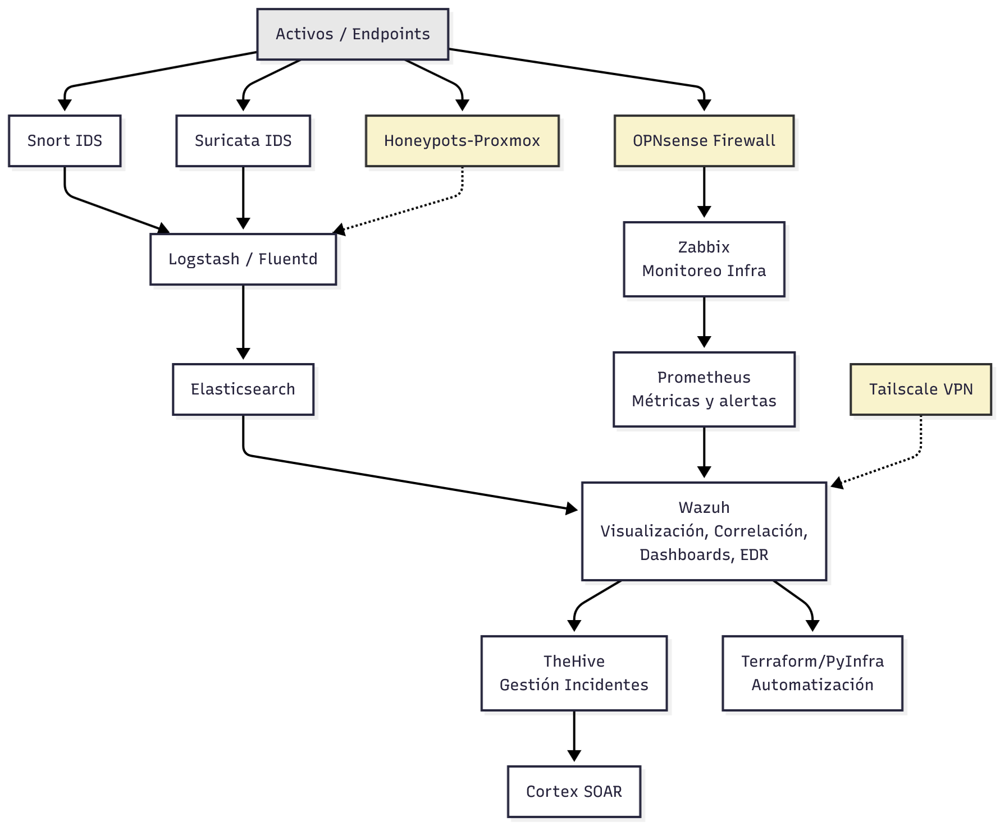

# 🛡️ Arquitectura SOC - Concepto de Diseño

Este es un concepto de arquitectura para un Security Operations Center (SOC) completo, diseñado para proporcionar capacidades avanzadas de detección, monitoreo, análisis y respuesta ante incidentes de seguridad.

> **Nota**: Este es un concepto en fase de diseño. La implementación no ha comenzado y está sujeta a cambios según las necesidades del proyecto.

## 🏗️ Componentes de la Arquitectura

### Capa de Detección (IDS/IPS)
- **Snort**: Sistema de detección de intrusiones basado en reglas
- **Suricata**: IDS/IPS de alto rendimiento con capacidades de detección avanzadas
- Ambos monitorizan el tráfico de red desde los endpoints

### Agregación y Almacenamiento de Logs
- **Logstash/Fluentd**: Pipeline de procesamiento y agregación de logs
- **Elasticsearch**: Motor de búsqueda y análisis para almacenamiento de eventos

### Monitoreo de Infraestructura
- **Zabbix**: Monitoreo de disponibilidad y rendimiento de infraestructura
- **Prometheus**: Sistema de métricas y alertas en tiempo real

### Plataforma Central de Seguridad
- **Wazuh**: Plataforma unificada que proporciona:
  - Visualización de eventos de seguridad
  - Correlación de eventos
  - Dashboards personalizables
  - Capacidades EDR (Endpoint Detection and Response)

### Gestión de Incidentes y Automatización
- **TheHive**: Plataforma de gestión y respuesta a incidentes de seguridad
- **Cortex**: SOAR (Security Orchestration, Automation and Response)
- **Terraform/PyInfra**: Herramientas de automatización y gestión de infraestructura como código

### 🔮 Componentes Planeados a Largo Plazo

> **Los componentes resaltados en amarillo en el diagrama representan funcionalidades planeadas para implementación a muy largo plazo.**

- **Honeypots-Proxmox**: Sistema de señuelos virtualizado para atraer y analizar ataques
- **OPNsense Firewall**: Firewall de código abierto para control de tráfico y segmentación
- **Tailscale VPN**: Solución de VPN mesh para acceso remoto seguro

## 🔄 Flujo de Datos
```
1. Endpoints → IDS (Snort/Suricata) → Logstash → Elasticsearch → Wazuh
2. Endpoints → Firewall → Zabbix → Prometheus → Wazuh
3. Wazuh → TheHive → Cortex (para respuesta automatizada)
4. Honeypots/VPN → Logstash/Wazuh (componentes futuros)
```

## 📊 Diagrama de Arquitectura



*Los componentes en amarillo son planes a muy largo plazo*

## 🎯 Objetivos del SOC

- **Detección proactiva** de amenazas mediante múltiples capas de seguridad
- **Visibilidad completa** de eventos de seguridad en toda la infraestructura
- **Respuesta rápida** a incidentes mediante automatización
- **Análisis forense** con almacenamiento centralizado de logs
- **Mejora continua** mediante métricas y dashboards

## 🛠️ Tecnologías Utilizadas

| Componente | Propósito | Tipo | Estado |
|:---:|:---:|:---:|:---:|
| Snort/Suricata | Detección de intrusiones | IDS/IPS | Planeado |
| Logstash/Fluentd | Agregación de logs | Pipeline | Planeado |
| Elasticsearch | Almacenamiento | Base de datos | Planeado |
| Wazuh | Plataforma de seguridad | SIEM/XDR | Planeado |
| Zabbix | Monitoreo de infraestructura | Monitoreo | Planeado |
| Prometheus | Métricas y alertas | Monitoreo | Planeado |
| TheHive | Gestión de incidentes | Ticketing | Planeado |
| Cortex | Orquestación | SOAR | Planeado |
| Terraform/PyInfra | Automatización | IaC | Planeado |
| Honeypots-Proxmox | Señuelos de seguridad | Deception | Largo plazo |
| OPNsense | Firewall perimetral | Network Security | Largo plazo |
| Tailscale | Acceso remoto seguro | VPN | Largo plazo |

## 📝 Estado del Proyecto

**Estado actual**: Concepto en diseño - No implementado

Este proyecto se encuentra en fase de conceptualización y planificación. Los componentes, arquitectura y flujos de datos están siendo evaluados y pueden sufrir modificaciones. **No se ha comenzado ninguna implementación.**

## ⚠️ Consideraciones

- Los componentes resaltados en **amarillo** son características planeadas para el futuro lejano
- La arquitectura puede adaptarse según las necesidades específicas del entorno
- El diseño busca ser escalable y modular para permitir crecimiento gradual
- Este es un documento conceptual que define la visión a largo plazo del proyecto

## 📚 Referencias

- [Wazuh Documentation](https://documentation.wazuh.com/)
- [Elastic Stack Guide](https://www.elastic.co/guide/)
- [TheHive Project](https://thehive-project.org/)
- [Suricata User Guide](https://suricata.readthedocs.io/)
- [Prometheus Documentation](https://prometheus.io/docs/)

## 📄 Licencia

Este concepto de arquitectura es de carácter educativo y de investigación.
